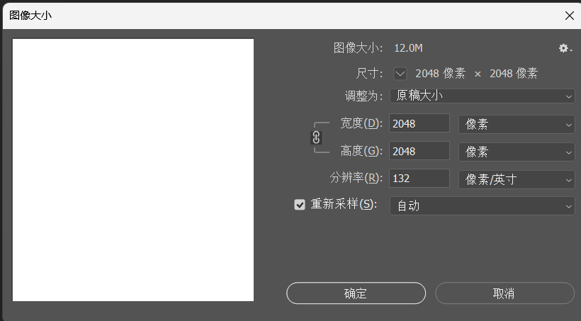
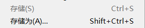
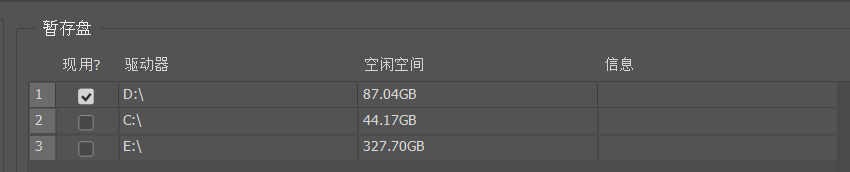
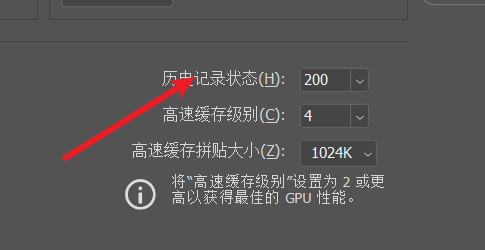
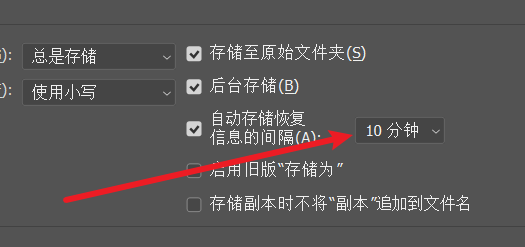
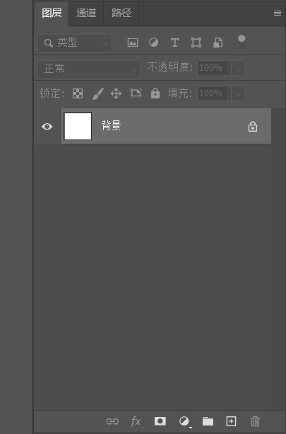
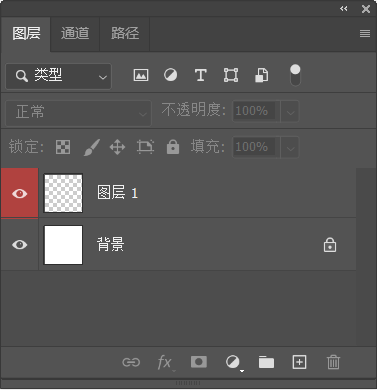
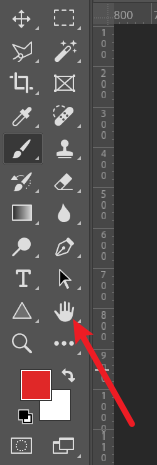
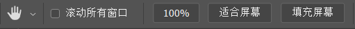

## 目录
- [目录](#目录)
- [软件认识](#软件认识)
- [新建文档](#新建文档)
  - [新建](#新建)
    - [分辨率](#分辨率)
    - [颜色模式](#颜色模式)
- [图片大小修改](#图片大小修改)
  - [重新采样](#重新采样)
- [储存文件](#储存文件)
  - [文件格式](#文件格式)
- [性能配置](#性能配置)
- [图层](#图层)
- [视图操作](#视图操作)
  - [抓手工具(H)](#抓手工具h)
  - [缩放工具(Z)](#缩放工具z)
  - [旋转视图工具(R)](#旋转视图工具r)

## 软件认识

PS 全称是 Adobe Photoshop，是 Adobe 公司开发的一款专业图像处理软件，被广泛用于平面设计、摄影后期、数字绘画等领域。无论是专业设计师还是普通用户，都能通过它实现对图像的各种创意处理，是目前行业内主流的图像处理工具之一。

界面：

## 新建文档

### 新建

ctrl + N 可以新建文档，也可以在进入软件的时候点击新文件新建文档

在这个界面可以选择自己想要的文档尺寸，比如要打印a4的，可以去打印一栏中找到a4大小的文档，也可以自己自定义

#### 分辨率

就是 像素 / 英寸 ，也可以选择 像素 / 厘米, 不过前面一个比较常用

在图片大小固定的时候，想要使图像变清晰，可以提高分辨率，但是分辨率不是越大越好，过高的分辨率会占用性能

#### 颜色模式

**RGB**：由红（Red）、绿（Green）、蓝（Blue）三种基色组成，属于光的三原色，适用于屏幕显示（如电脑、手机、电视等）。
**原理**：是通过光的叠加产生颜色，三种颜色全亮时为白色，全暗时为黑色，广泛用于数字图像、网页设计等。

**CMYK**：由青（Cyan）、品红（Magenta）、黄（Yellow）、黑（Key/Black）四种颜色组成，属于印刷三原色，适用于纸质印刷（如杂志、海报、书籍等）。
**原理**：是通过颜料的混合吸收光线产生颜色，四种颜色叠加时接近黑色，主要用于保证印刷品色彩的准确性。

## 图片大小修改

快捷键 ctrl + alt + i
也可以在菜单栏选择 图像 ->  图像大小

像素的大小决定了图像的大小

在宽度和高度旁边的小锁链，勾选的时候可以使宽度和高度修改时成比例

### 重新采样

取消重新采样，图像的大小就确定了，像素值就修改不了了，但是可以重新修改分辨率，也可以修改图像的高度和宽度，不过不是以像素为单位

画面总像素值 = 宽度像素值 * 高度像素值
画面总像素值 = 高（英寸） * 宽（英寸） * 分辨率（像素 / 英寸）的平方

## 储存文件

在上方的文件选项中可以找到

存储是保存在该文件上的修改，存储为是另外保存一份文件，在保存的时候要选择想要的格式，简单介绍一下3种常用的格式

### 文件格式

**PSD**
PSD是Photoshop的标注文件格式，包含颜色，图层，通道，路径，动画等信息，是创作图形作品的原始文件

**JPG**
是最流行的图片文件格式，体积小巧，可变压缩比，支持交错，广泛运用于互联网传输，是我们最常见的图片格式

**GIF**
支持透明色，支持动画，我们在网页上看到的动态图，聊天表情大都是GIF图片

## 性能配置
对ps进行一些小小的设置，方便使用

在上方编辑 -> 首选项 -> 常规

**暂存盘**
ps在运行时产生的临时数据，尽量不要放在c盘

**历史记录**
可以设置高一点，便于后续返回历史状态

**文件处理**
可以设置为5或10分钟保存一次，防止软件崩溃

## 图层

在上方窗口 -> 图层 可以调出这一栏

ctrl + shift + n 可以新建图层，也可以点击图层那一栏下方的加号新建

右键**小眼睛的区域**，可以改变图层的颜色，只是便于标识，双击**图层名称位置**可以进行图层名称的修改

单击小眼睛则可以**显示或者隐藏图层**，按住alt键，可以只显示某个图层，将其余的进行隐藏，**直接拖动图层可以改变上下的顺序**

按住alt键，可以直接复制图层，也可以使用ctrl + j 复制后的图层会自动位于上方

## 视图操作

### 抓手工具(H)
可以对画面进行移动

选择**滚动窗口**是对所有打开的文档进行操作

**适合屏幕**会使整个画面都能在屏幕中看见

**填充屏幕**是指画面会尽量缩放并装满屏幕

**重点**：按住空格后用鼠标左键也可以进行移动，这个比较常用

### 缩放工具(Z)

有**放大**和**缩小**两种方式，勾选**细微缩放**，点击图像左右移动鼠标对视图进行缩放，取消后就不会流畅的缩放

**重点**：alt + 鼠标滚轮基本上是最常见的使用方式

### 旋转视图工具(R)

