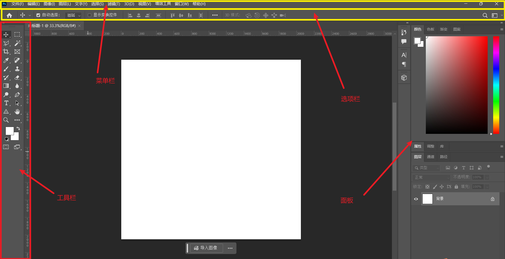
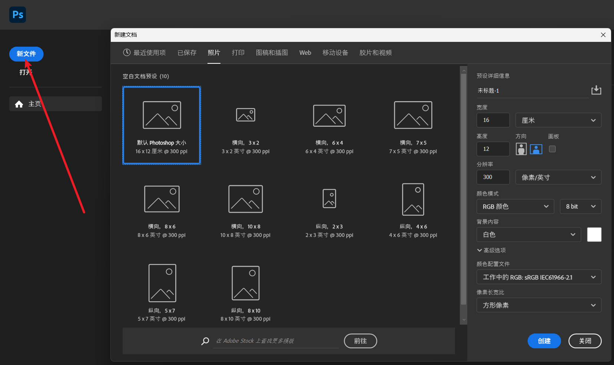
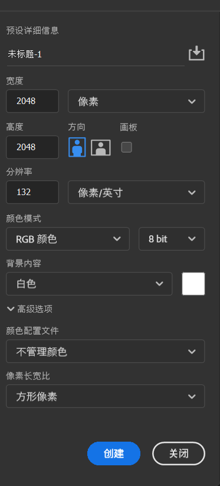
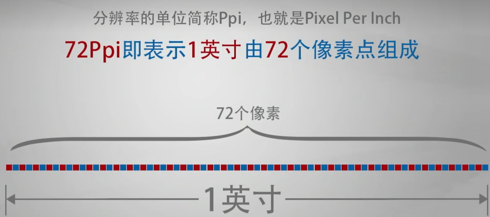

## 目录
- [目录](#目录)
- [软件认识](#软件认识)
- [新建文档](#新建文档)
  - [新建](#新建)
    - [分辨率](#分辨率)
    - [颜色模式](#颜色模式)
- [图片大小修改](#图片大小修改)

## 软件认识

PS 全称是 Adobe Photoshop，是 Adobe 公司开发的一款专业图像处理软件，被广泛用于平面设计、摄影后期、数字绘画等领域。无论是专业设计师还是普通用户，都能通过它实现对图像的各种创意处理，是目前行业内主流的图像处理工具之一。

界面：

## 新建文档

### 新建

ctrl + N 可以新建文档，也可以在进入软件的时候点击新文件新建文档

在这个界面可以选择自己想要的文档尺寸，比如要打印a4的，可以去打印一栏中找到a4大小的文档，也可以自己自定义

#### 分辨率

就是 像素 / 英寸 ，也可以选择 像素 / 厘米, 不过前面一个比较常用

在图片大小固定的时候，想要使图像变清晰，可以提高分辨率，但是分辨率不是越大越好，过高的分辨率会占用性能

#### 颜色模式

**RGB**：由红（Red）、绿（Green）、蓝（Blue）三种基色组成，属于光的三原色，适用于屏幕显示（如电脑、手机、电视等）。
**原理**：是通过光的叠加产生颜色，三种颜色全亮时为白色，全暗时为黑色，广泛用于数字图像、网页设计等。

**CMYK**：由青（Cyan）、品红（Magenta）、黄（Yellow）、黑（Key/Black）四种颜色组成，属于印刷三原色，适用于纸质印刷（如杂志、海报、书籍等）。
**原理**：是通过颜料的混合吸收光线产生颜色，四种颜色叠加时接近黑色，主要用于保证印刷品色彩的准确性。

## 图片大小修改

快捷键 ctrl + alt + i

也可以在菜单栏选择 图像 ->  图像大小

